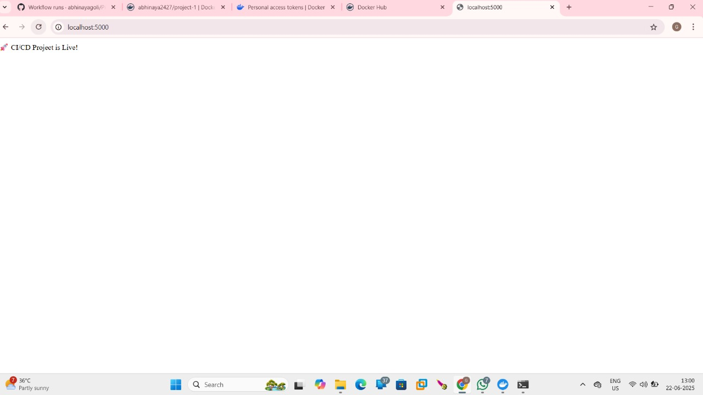
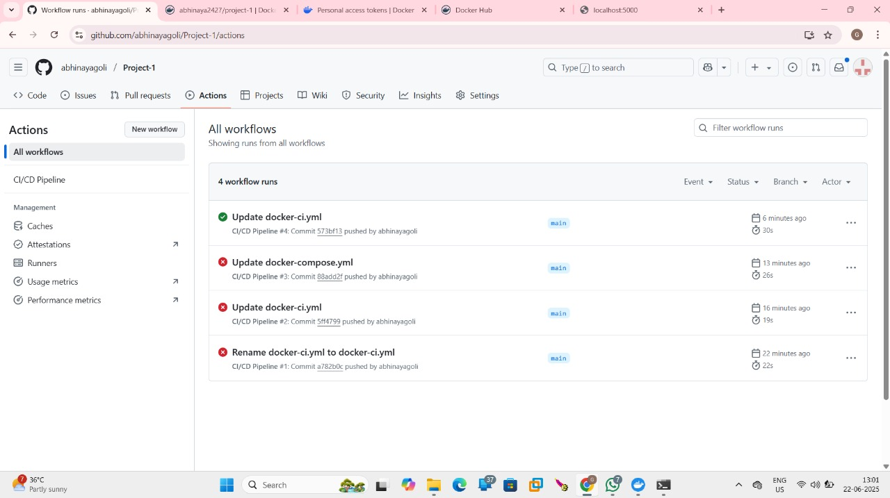

# Project-1

A brief project description goes here — explain what the app/project does and its purpose.

## 🛠️ Prerequisites

List required tools/libraries (e.g. Node.js, Python, React).

```bash
# Example
npm install
```

## 🚀 Installation & Usage

Step-by-step setup:

```bash
git clone https://github.com/abhinayagoli/Project-1.git
cd Project-1
# any build/script commands
```

How to run it and usage instructions.

## 📸 Screenshots

Below are two example screenshots:


*Figure 1: Key feature or page demonstration.*


*Figure 2: Another core view or workflow.*

## 💡 Features

- Feature 1 with short description  
- Feature 2 with short description  
- Feature 3  

## ℹ️ Tech Stack

List of languages/frameworks/tools used.

## 🤝 Contributing

Instructions for others to help out: forks, pull requests, issues.

## 📄 License

License name and description, if applicable.
